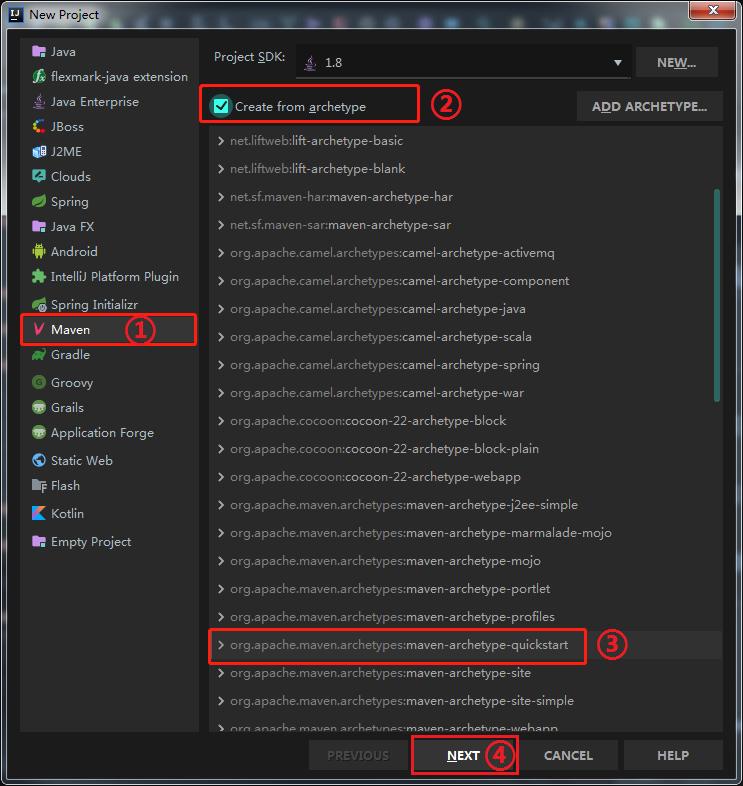
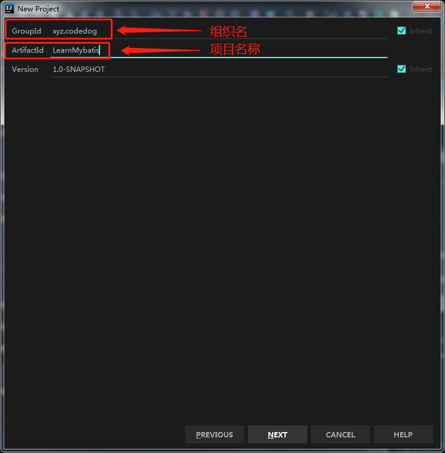
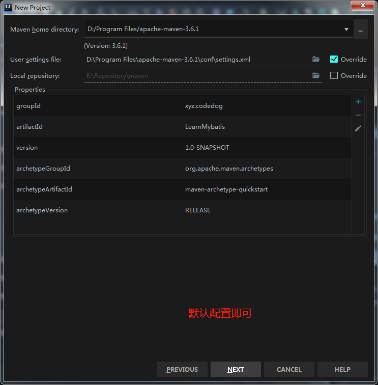
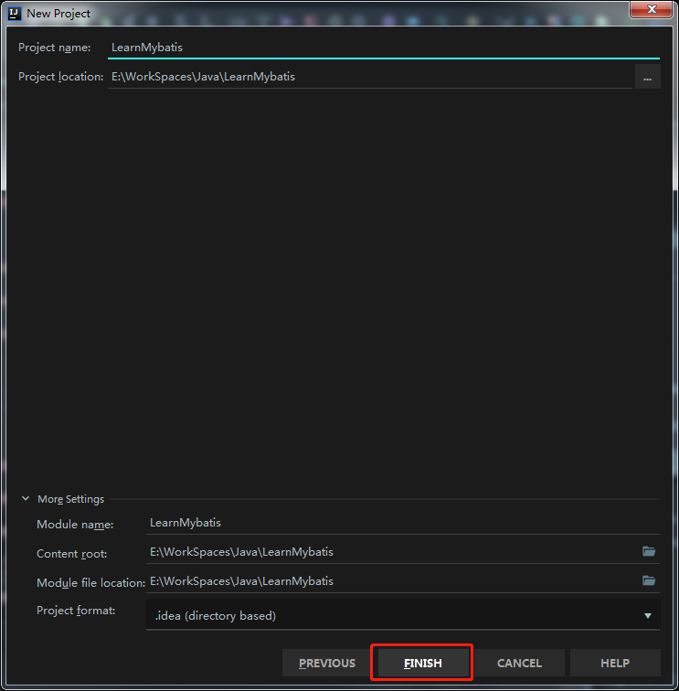

# LearnMybatis #

## 目录

### 一. [环境搭建](#环境搭建) ####
### 二. 数据库表的建立 ###
### 三. 使用XML方式配置 ###

---

### 环境搭建 ###
#### 1. 创建maven项目 ####
##### 在Intellij IDEA中创建maven项目

##### 项目创建完成后,我们需要添加一些依赖才能使接下来的工作能够顺利进行.可以通过[maven中心仓库](https://mvnrepository.com/)来查找所需依赖坐标,具体的配置可参考[pom.xml](pom.xml) ####
#### 2. 
